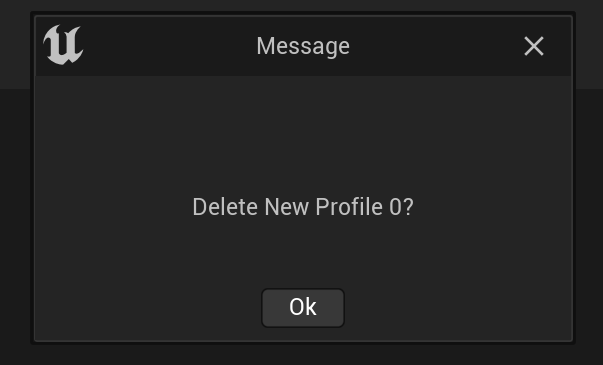
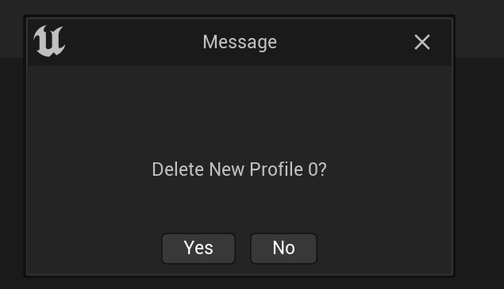

## 自定义简易对话框

### 问题
- 独立应用程序（Standalone Program）使用如下形式的对话框有问题，如下所示
```c++
// call this in standalone program
FMessageDialog::Open(EAppMsgType::OkCancel, Prompt)

// get the error on log
/*
LogWindows: Error: Failed to create dialog. The specified resource type cannot be found in the image file. Error: 0x715 (1813)
*/
```

### 安装方法
1. 将NewMessageDialog模块整个文件夹移入源码版引擎（5.2）中的`Engine\Source\Developer`目录下
2. 重新编译引擎

### 使用方法
1. 将模块`NewMessageDialog`加入将要使用的模块的`build.cs`文件中
```c#
PrivateDependencyModuleNames.Add("NewMessageDialog");
```
2. 像使用`FMessageDialog`一样
```c++
SNewMessageDialog::Open(EAppMsgType::OkCancel, Message);
```

### 说明
1. 目前仅支持的对话框形式：Ok、YesNo。其余可自行拓展

### 展示

